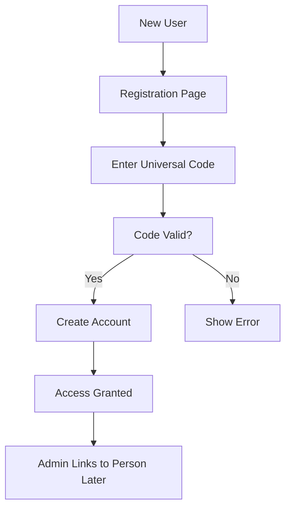
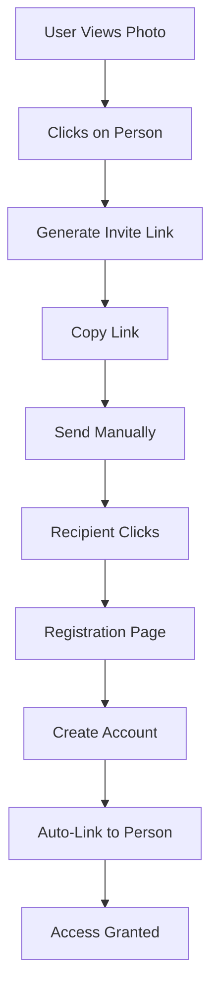

# RFC-001: Authentication & Authorization System

**Status:** Draft  
**Date:** 2025-01-25  
**Author:** Architecture Team

## Summary

This RFC proposes an authentication and authorization system for the Family Tree application that restricts access to registered users only. New users can join through:
1. **Universal invite code** (environment variable) for initial bootstrap
2. **Person-specific invitation links** generated when clicking on people in photos

This creates a natural onboarding flow where family members invite each other by identifying people in shared photos.

## Motivation

The Family Tree application contains sensitive family photos and genealogical data that should only be accessible to family members. By requiring invitations tied to photo identifications, we:

1. Ensure only legitimate family members gain access
2. Create natural user-person associations
3. Build trust through existing family connections
4. Simplify onboarding by connecting new users to their representation in the family tree

## Design Overview

### Core Concepts

1. **Closed Registration**: No public signup - only invitation-based or universal code
2. **Photo-Based Invitations**: Invites are created by clicking on people in photos
3. **User-Person Relationship**: Database supports 1:many but MVP implements 1:1 only
4. **Invitation Types**:
   - **Universal Code**: Environment variable for initial bootstrap
   - **Person-Specific**: Generated links tied to people in photos
5. **Simple Permissions**: All users can view/edit, admins manage users

### User Flows

#### Flow 1: Universal Code Registration


#### Flow 2: Person-Specific Invitation


## Technical Design

### Database Schema

```sql
-- New tables needed

CREATE TABLE users (
    id UUID PRIMARY KEY DEFAULT gen_random_uuid(),
    email VARCHAR(255) UNIQUE NOT NULL,
    username VARCHAR(100) UNIQUE NOT NULL,
    password_hash VARCHAR(255) NOT NULL,
    is_active BOOLEAN DEFAULT true NOT NULL,
    is_admin BOOLEAN DEFAULT false NOT NULL,
    created_at TIMESTAMP DEFAULT NOW() NOT NULL,
    updated_at TIMESTAMP DEFAULT NOW() NOT NULL,
    last_login_at TIMESTAMP,
    email_verified_at TIMESTAMP
);

CREATE TABLE user_persons (
    user_id UUID NOT NULL REFERENCES users(id) ON DELETE CASCADE,
    person_id UUID NOT NULL REFERENCES people(id) ON DELETE CASCADE,
    is_primary BOOLEAN DEFAULT false NOT NULL, -- For future multi-person support
    linked_at TIMESTAMP DEFAULT NOW() NOT NULL,
    linked_by UUID REFERENCES users(id), -- Who created this link
    PRIMARY KEY (user_id, person_id)
);

CREATE TABLE invitations (
    id UUID PRIMARY KEY DEFAULT gen_random_uuid(),
    token VARCHAR(255) UNIQUE NOT NULL, -- Secure random token
    person_id UUID REFERENCES people(id) ON DELETE CASCADE, -- NULL for universal code
    created_by UUID REFERENCES users(id) ON DELETE CASCADE, -- NULL for system-generated
    expires_at TIMESTAMP NOT NULL,
    used_at TIMESTAMP,
    used_by UUID REFERENCES users(id),
    image_id UUID REFERENCES images(id), -- Source image for context
    invitation_type VARCHAR(20) NOT NULL DEFAULT 'person', -- 'person' or 'universal'
    created_at TIMESTAMP DEFAULT NOW() NOT NULL
);

-- No sessions table needed - using JWT tokens

-- Indexes for performance
CREATE INDEX idx_user_persons_user ON user_persons(user_id);
CREATE INDEX idx_user_persons_person ON user_persons(person_id);
CREATE INDEX idx_invitations_token ON invitations(token);
CREATE INDEX idx_invitations_person ON invitations(person_id);
CREATE INDEX idx_users_email ON users(email);
CREATE INDEX idx_users_username ON users(username);
```

### API Endpoints

#### Authentication Endpoints

```typescript
// Public endpoints (no auth required)
POST   /api/auth/register      // With valid invitation token
POST   /api/auth/login         // Email/password login
POST   /api/auth/logout        // Clear session
POST   /api/auth/refresh       // Refresh session token
GET    /api/auth/verify-invite // Check invitation validity

// Protected endpoints
GET    /api/auth/me           // Current user info
PATCH  /api/auth/me           // Update profile
POST   /api/auth/change-password
```

#### Invitation Endpoints

```typescript
// All require authentication
POST   /api/invitations                    // Create invitation for person
GET    /api/invitations                    // List sent invitations
GET    /api/invitations/:id                // Get invitation details
DELETE /api/invitations/:id                // Revoke invitation
POST   /api/invitations/:id/resend         // Resend invitation email
```

#### User-Person Link Endpoints

```typescript
// All require authentication
GET    /api/users/me/persons              // Get linked person records
POST   /api/users/me/persons              // Link to another person
DELETE /api/users/me/persons/:personId    // Unlink from person
PATCH  /api/users/me/persons/:personId    // Set as primary
```

### Implementation Details

#### 1. Environment Configuration

```env
# .env
UNIVERSAL_INVITE_CODE=FAMILY2024PHOTOS
JWT_SECRET=your-secure-random-secret-at-least-32-chars
JWT_EXPIRES_IN=7d
BCRYPT_ROUNDS=12
```

#### 2. Authentication Middleware

```typescript
// middleware/auth.ts
import { NextRequest, NextResponse } from 'next/server';
import jwt from 'jsonwebtoken';

export async function authMiddleware(request: NextRequest) {
    const token = request.cookies.get('auth-token')?.value || 
                  request.headers.get('authorization')?.replace('Bearer ', '');
    
    if (!token) {
        return NextResponse.json({ error: 'Unauthorized' }, { status: 401 });
    }
    
    try {
        const payload = jwt.verify(token, process.env.JWT_SECRET!) as {
            userId: string;
            email: string;
            isAdmin: boolean;
        };
        
        // Attach user to request context
        request.headers.set('x-user-id', payload.userId);
        request.headers.set('x-user-email', payload.email);
        request.headers.set('x-is-admin', payload.isAdmin.toString());
        
        return NextResponse.next();
    } catch (error) {
        return NextResponse.json({ error: 'Invalid token' }, { status: 401 });
    }
}
```

#### 3. Invitation Service

```typescript
// services/InvitationService.ts
export class InvitationService {
    async createPersonInvitation(data: {
        personId: string;
        createdBy: string;
        imageId?: string;
    }): Promise<{ inviteUrl: string; invitation: Invitation }> {
        const token = generateSecureToken();
        const expiresAt = new Date();
        expiresAt.setDate(expiresAt.getDate() + 7); // 7 days
        
        const [invitation] = await db.insert(invitations).values({
            token,
            personId: data.personId,
            createdBy: data.createdBy,
            imageId: data.imageId,
            invitationType: 'person',
            expiresAt
        }).returning();
        
        const inviteUrl = `${process.env.NEXT_PUBLIC_APP_URL}/invite/${token}`;
        
        return { inviteUrl, invitation };
    }
    
    async validateInvitation(token: string): Promise<InvitationValidation> {
        const invite = await db.select()
            .from(invitations)
            .where(and(
                eq(invitations.token, token),
                isNull(invitations.usedAt),
                gt(invitations.expiresAt, new Date())
            ))
            .leftJoin(people, eq(invitations.personId, people.id))
            .leftJoin(images, eq(invitations.imageId, images.id));
            
        if (!invite[0]) {
            return { valid: false, reason: 'Invalid or expired invitation' };
        }
        
        return {
            valid: true,
            invitation: invite[0].invitations,
            person: invite[0].people,
            image: invite[0].images
        };
    }
}
```

#### 4. Registration & Auth Services

```typescript
// services/AuthService.ts
import bcrypt from 'bcrypt';
import jwt from 'jsonwebtoken';

export class AuthService {
    async registerWithInvitation(data: {
        invitationToken: string;
        email: string;
        username: string;
        password: string;
    }): Promise<{ user: User; token: string }> {
        // Validate invitation
        const validation = await invitationService.validateInvitation(data.invitationToken);
        if (!validation.valid) {
            throw new Error(validation.reason);
        }
        
        // Begin transaction
        const result = await db.transaction(async (tx) => {
            // Create user
            const hashedPassword = await bcrypt.hash(data.password, Number(process.env.BCRYPT_ROUNDS));
            const [user] = await tx.insert(users).values({
                email: data.email,
                username: data.username,
                passwordHash: hashedPassword
            }).returning();
            
            // Link user to person if person-specific invitation
            if (validation.invitation.personId) {
                await tx.insert(userPersons).values({
                    userId: user.id,
                    personId: validation.invitation.personId,
                    isPrimary: true,
                    linkedBy: validation.invitation.createdBy
                });
            }
            
            // Mark invitation as used
            await tx.update(invitations)
                .set({ 
                    usedAt: new Date(), 
                    usedBy: user.id 
                })
                .where(eq(invitations.id, validation.invitation.id));
            
            return user;
        });
        
        // Generate JWT
        const token = this.generateToken(result);
        
        return { user: result, token };
    }
    
    async registerWithUniversalCode(data: {
        code: string;
        email: string;
        username: string;
        password: string;
    }): Promise<{ user: User; token: string }> {
        // Validate universal code
        if (data.code !== process.env.UNIVERSAL_INVITE_CODE) {
            throw new Error('Invalid invitation code');
        }
        
        // Create user
        const hashedPassword = await bcrypt.hash(data.password, Number(process.env.BCRYPT_ROUNDS));
        const [user] = await db.insert(users).values({
            email: data.email,
            username: data.username,
            passwordHash: hashedPassword
        }).returning();
        
        // Generate JWT
        const token = this.generateToken(user);
        
        return { user, token };
    }
    
    async login(email: string, password: string): Promise<{ user: User; token: string }> {
        const [user] = await db.select()
            .from(users)
            .where(eq(users.email, email))
            .limit(1);
            
        if (!user || !await bcrypt.compare(password, user.passwordHash)) {
            throw new Error('Invalid credentials');
        }
        
        if (!user.isActive) {
            throw new Error('Account deactivated');
        }
        
        // Update last login
        await db.update(users)
            .set({ lastLoginAt: new Date() })
            .where(eq(users.id, user.id));
        
        const token = this.generateToken(user);
        
        return { user, token };
    }
    
    private generateToken(user: User): string {
        return jwt.sign(
            {
                userId: user.id,
                email: user.email,
                isAdmin: user.isAdmin
            },
            process.env.JWT_SECRET!,
            { expiresIn: process.env.JWT_EXPIRES_IN }
        );
    }
}
```

### Security Considerations

1. **Password Requirements**
   - Minimum 8 characters (keeping it simple for family)
   - At least one uppercase, lowercase, and number
   - bcrypt with 12 rounds

2. **JWT Security**
   - Secure, httpOnly cookies for web
   - Authorization header for API
   - 7-day expiration
   - No refresh tokens (KISS principle)

3. **Invitation Security**
   - Cryptographically secure random tokens (32 bytes)
   - Single-use only
   - 7-day expiration
   - Universal code in environment variable

4. **Rate Limiting** (future enhancement)
   ```yaml
   Login attempts: 5 per 15 minutes per IP
   Invitation creation: 10 per hour per user
   Registration: 3 per hour per IP
   ```

### Frontend Integration

#### 1. Protected Routes

```typescript
// middleware.ts
export function middleware(request: NextRequest) {
    const token = request.cookies.get('session');
    const isAuthPage = request.nextUrl.pathname.startsWith('/auth');
    const isInvitePage = request.nextUrl.pathname.startsWith('/invite');
    
    if (!token && !isAuthPage && !isInvitePage) {
        return NextResponse.redirect(new URL('/auth/login', request.url));
    }
}

export const config = {
    matcher: ['/((?!api|_next/static|_next/image|favicon.ico).*)'],
};
```

#### 2. Invitation UI Enhancement

```typescript
// components/PersonBoundingBox.tsx enhancement
export function PersonBoundingBox({ person, onRemove }: PersonBoundingBoxProps) {
    const [showInviteLink, setShowInviteLink] = useState(false);
    const [inviteUrl, setInviteUrl] = useState<string | null>(null);
    
    const handleInvite = async () => {
        try {
            const response = await api.invitations.create({
                personId: person.id,
                imageId: currentImageId
            });
            setInviteUrl(response.inviteUrl);
            setShowInviteLink(true);
        } catch (error) {
            console.error('Failed to create invitation:', error);
        }
    };
    
    return (
        <>
            <div className="person-box">
                {/* Existing person display */}
                <button
                    onClick={handleInvite}
                    className="invite-button"
                    title="Generate invitation link"
                >
                    <FontAwesomeIcon icon={faLink} />
                </button>
            </div>
            
            {showInviteLink && inviteUrl && (
                <div className="invite-modal">
                    <p>Invitation link for {person.name}:</p>
                    <input 
                        value={inviteUrl} 
                        readOnly 
                        onClick={(e) => e.currentTarget.select()}
                    />
                    <button onClick={() => navigator.clipboard.writeText(inviteUrl)}>
                        Copy Link
                    </button>
                </div>
            )}
        </>
    );
}
```

## Implementation Plan

### Phase 1: Core Authentication
1. Create database schema (users, user_persons, invitations)
2. Implement JWT authentication with bcrypt
3. Build login/registration endpoints
4. Create auth middleware
5. Add universal code registration flow

### Phase 2: Invitation System
1. Person-specific invitation generation
2. Add invite button to PersonBoundingBox
3. Create invitation validation logic
4. Build registration flow with auto-linking to person

### Phase 3: Frontend Integration
1. Protected route wrapper
2. Auth context provider
3. Login/registration pages
4. Update all API calls with auth headers
5. Handle 401 responses globally

### Phase 4: Admin Features
1. User management page
2. Invitation history view
3. Manual user-person linking
4. Basic admin dashboard

## Testing Strategy

1. **Unit Tests**
   - Auth service methods
   - Invitation validation
   - Session management
   - Password hashing

2. **Integration Tests**
   - Full registration flow
   - Login/logout cycles
   - Invitation expiration
   - User-person linking

3. **Security Tests**
   - SQL injection attempts
   - Brute force protection
   - Token generation randomness
   - Session hijacking prevention

## Performance Considerations

1. **Database Indexes**
   - All foreign keys indexed
   - Token lookups optimized
   - Session queries efficient

2. **Caching**
   - Cache user permissions
   - Cache session validation
   - Redis for session storage

3. **Query Optimization**
   - Batch user-person lookups
   - Eager load relationships
   - Minimize N+1 queries

## Future Enhancements

1. **Social Login**
   - OAuth providers (Google, Facebook)
   - Still require invitation

2. **Advanced Permissions**
   - Branch-level privacy
   - Photo album permissions
   - Edit vs view rights

3. **Multi-Factor Authentication**
   - TOTP support
   - SMS verification
   - Backup codes

4. **Admin Features**
   - User management
   - Invitation analytics
   - Security audit logs

## Implementation Checklist

- [ ] Database schema creation
- [ ] User model and service
- [ ] Session management
- [ ] Auth middleware
- [ ] Invitation service
- [ ] Registration flow
- [ ] Login/logout endpoints
- [ ] Frontend auth context
- [ ] Protected route wrapper
- [ ] Invitation UI components
- [ ] Email notifications
- [ ] Rate limiting
- [ ] Security headers
- [ ] Password validation
- [ ] Session cleanup job
- [ ] Documentation
- [ ] Test coverage

## Summary

This RFC defines a simple, secure authentication system for the Family Tree application:

1. **Closed system** - No public registration
2. **Two invitation methods**:
   - Universal code (env variable) for bootstrap
   - Person-specific links from photo tagging
3. **JWT-based auth** - Simple, stateless tokens
4. **Simple permissions** - All users can view/edit, admins manage users
5. **KISS principle** - No unnecessary complexity, can enhance later

The system creates a natural onboarding flow where family members invite each other by identifying people in photos, automatically linking new users to their representation in the family tree.